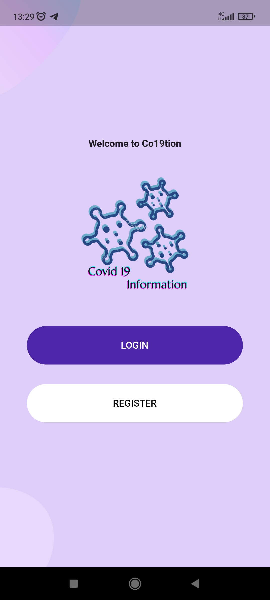
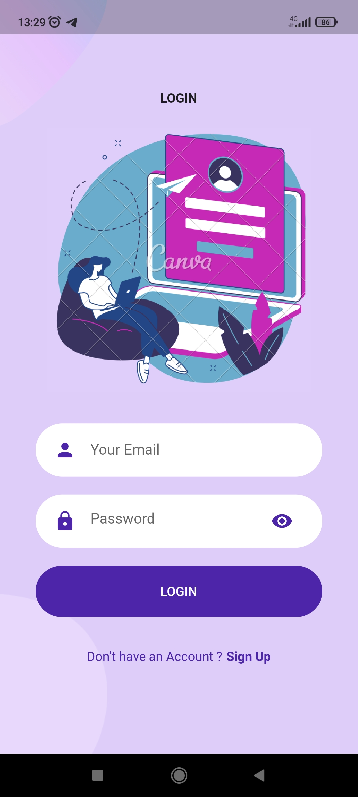
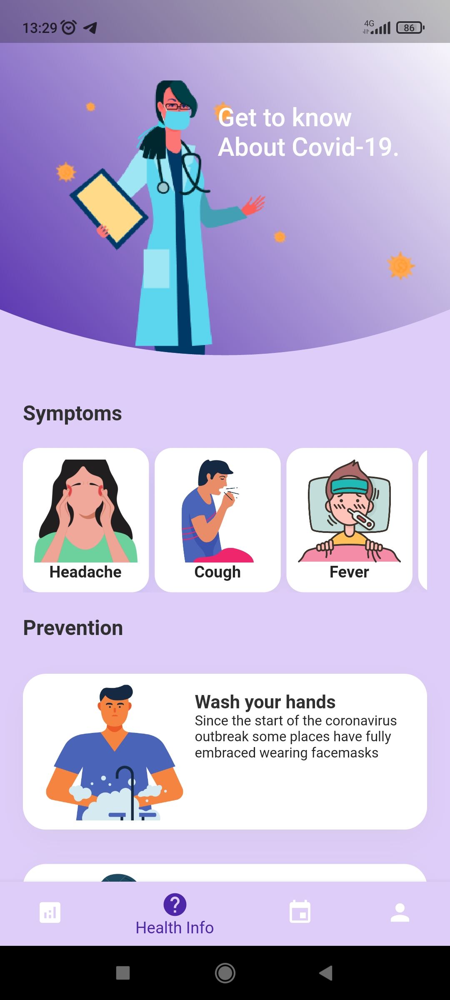
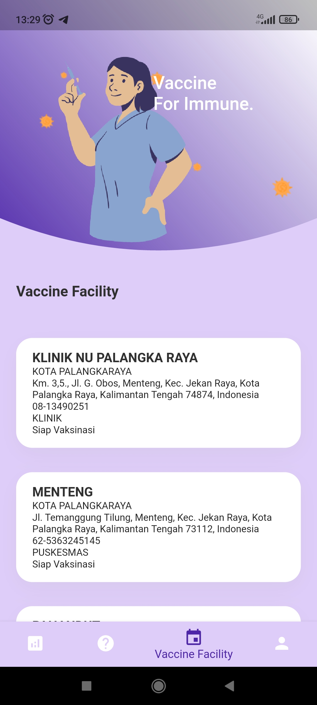

# Mini Project Covid App

## Nama : Satria Septa Arianto   Nim : 193020503026   Asal Instansi : Universitas Palangkaraya  

###
COVID-19 adalah penyakit menular yang disebabkan oleh SARS-CoV-2, salah satu jenis koronavirus. Penderita COVID-19 dapat mengalami demam, batuk kering, dan kesulitan bernafas. Akhir-akhir ini semakin banyak varian dari COVID-19 ini karena penyakit ini semacam flu yang dapat beradaptasi dengan kekebalan tubuh manusia.

Walaupun masa kini dianggap sudah memasuki tahap akhir dari pandemi COVID-19, kita juga harus tetap menjaga kesehatan kita masing-masing karena mencegah lebih baik daripada mengobati.

Aplikasi ini ada untuk memberikan informasi seputar COVID-19, data kasus, cara pencegahan, pengobatan dan lokasi vaksinasi yang tersedia.

Dari aplikasi ini, diharapkan masyarakat lebih sadar akan kesehatannya masing-masing dan menjangkau lebih banyak lagi masyarakat diluar sana agar mendapat edukasi seputar COVID-19.

###
Aplikasi Covid 19 Information adalah aplikasi Android yang menyediakan informasi terupdate seputar data persebaran Covid 19, gejala dan pencegahan, serta fasilitas kesehatan yang tersedia untuk vaksinasi. Berikut adalah tampilan dari aplikasinya.

1. [welcome_screen.dart](./covid_app/lib/screens/welcome/welcome_screen.dart)  
    
2. [register_screen.dart](./covid_app/lib/screens/register/register_screen.dart)  
    
3. [login_screen.dart](./covid_app/lib/screens/login/login_screen.dart)  
    
4. [home_screen.dart](./covid_app/lib/screens/home_screen.dart)  
5. [info_screen.dart](./covid_app/lib/screens/info/info_screen.dart)  
    
6. [care_screen.dart](./covid_app/lib/screens/care_screen.dart)  
    
7. [facility_screen.dart](./covid_app/lib/screens/facility/facility_screen.dart)  
    
8. [user_screen.dart](./covid_app/lib/screens/user_screen.dart)  
    
